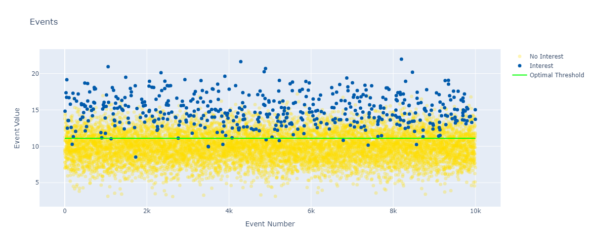

# 1st Version - [✅]
> System
- event
  - types: interested / not interested
  - each event single value
  - distribution - normal
- triggering system
  - above threshold - interested and capture
  - below threshold - not interested and ignore

> Estimator
- assume we know the ignored ones
- use ground truth for feedback

> Controller & Planner
- capture an uninterested one, threshold goes up a little bit
- capture an interested one, threshold goes down a little bit

> Modify the Parameters to Control

- the speed to converge
- the fluctuation
- etc

# 2nd Version - [✅]
- Feature - Metrics Calculation on the fly

> Results

> The control strategy is the same as the 1st version
> Online metrics calculation is implemented

# 3rd Version - [not ideal]
- New Feature - Metrics Guided Control

- stage 1: yes or no feedback
- stage 2: metrics guided control - not working well now

# 4th Version - [✅]
- New Feature - Offline Training - take the parameter that makes the Fbeta score the highest

> grid search

1. Collect Data
2. Offline Training
   - setup the starting point and the end point of the threshold
   - setup the step size
   - loop through the threshold, calculate the Precision, Recall, Fbeta score
   - take the parameter that makes the Fbeta score the highest

> Conclusions:
Small beta value: Precision is more important than Recall
Large beta value: Recall is more important than Precision

(1) F-beta = 1

(2) F-beta = 0.1

(3) F-beta = 10

# 5th Version - [✅]
- New Feature - Window Triggering Mechanism
- Dataset SATM - 4 types of events
- Accuracy, Precision, Recall, Fbeta Distribution

BETA = 2

